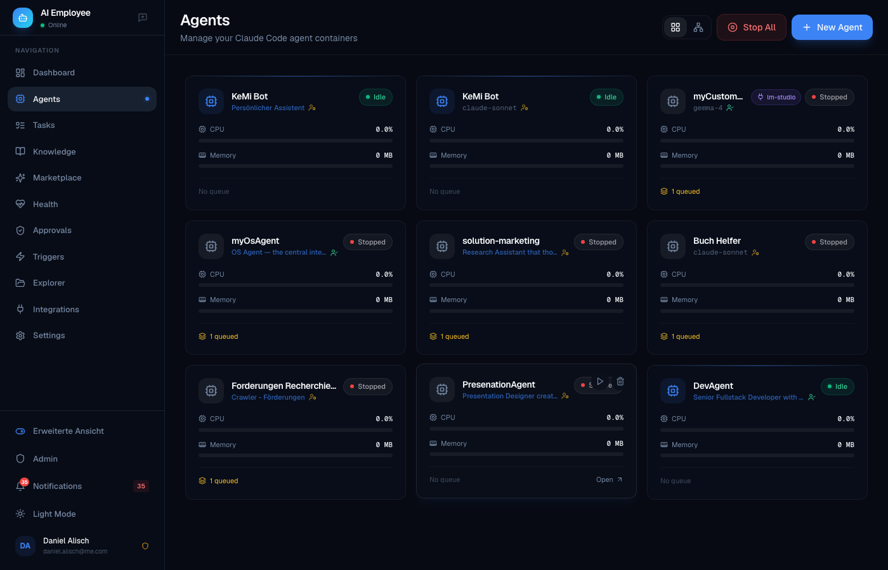

<div align="center">

# AgentERP

**AgentERP — Die KI-gesteuerte ERP-Alternative. Agents ersetzen SAP-Module durch Skills.**

[](LICENSE.md)
[](VERSION)
[](docker-compose.community.yml)
[](#governance--compliance)
[](#)

[Quick Start](#-quick-start) ·
[Features](#-features) ·
[Comparison](COMPARISON.md) ·
[Templates](#-agent-templates) ·
[Use Cases](#-use-cases) ·
[Roadmap](#roadmap) ·
[Contributing](CONTRIBUTING.md)

</div>

---

<div align="center">
  
  <p><em>Dashboard — live agent status, system health, task queue at a glance</em></p>
</div>

<div align="center">
  
  
  <p><em>Left: Agent grid with CPU/Memory monitoring &nbsp;·&nbsp; Right: Task history across all agents</em></p>
</div>

<div align="center">
  
  
  <p><em>Left: Approval request queue with risk levels &nbsp;·&nbsp; Right: L1–L4 autonomy whitelist editor</em></p>
</div>

---

> **Deutsch (Kurzfassung):** AI-Employee ist eine selbst gehostete Multi-Agent-KI-Plattform für KMU, regulierte Branchen und Teams im DACH-Raum. Jeder Agent läuft in einem isolierten Docker-Container, alle Daten bleiben bei Ihnen. Neu in v1.31: Self-Improvement-Engine — Skills mit schlechten Bewertungen werden automatisch von Agents verbessert. Skill-Analytics zeigt jetzt korrekte Nutzungszahlen. Positiver Feedback-Loop in usage_count gefixt. Neu in v1.29: Agent Detail Modal im Analytics-Dashboard, `skill_record_usage` MCP-Tool für präzises Skill-Tracking mit Task-Kontext, "Update All"-Button für Agent-Container-Updates, und dynamische Versionserkennung ohne Hardcoding. Neu in v1.28: Vollständige Multi-User-Datenisolation — jeder Nutzer sieht ausschließlich seine eigenen Agents, Tasks, Schedules, Approval-Regeln und eine eigene Knowledge Base (die automatisch von allen seinen Agents geteilt wird). Skill Analytics Dashboard — Zeitersparnis, ROI pro Skill und Agent-Performance auf einen Blick. Autonomie-Level L1–L4 mit Whitelist-Modell; alles außerhalb der Whitelist löst automatisch eine Freigabe-Anfrage aus. Native Microsoft 365-Integration über 25 MS-Graph-MCP-Tools; jeder Nutzer verbindet sein eigenes M365-Konto per OAuth. Kostenlos für den internen geschäftlichen Einsatz — eine kommerzielle Lizenz ist nur erforderlich, wenn Sie AI-Employee als SaaS an Dritte weiterverkaufen möchten. Kontakt: daniel.alisch@me.com

---

## What is AI-Employee?

Modern businesses need more than a single AI chatbot — they need **teams of specialized agents** that remember context, follow company rules, and collaborate on real work. But most AI platforms today force an uncomfortable trade-off: you either run everything in somebody else's cloud (losing control over your data) or you stitch together frameworks, vector DBs, and prompt templates by hand.

**AI-Employee is a self-hosted platform that gives each agent its own isolated Docker container, semantic memory, knowledge base, and governance rules — out of the box.** You can spin up a Fullstack Developer, a Legal Assistant, a Marketing Manager, and a Tax Preparer in minutes, each with their own role, workspace, and Telegram bot. Agents can hold meetings with each other, ask you for approval before spending money, deploy their own Docker apps, and reflect on their work to improve over time.

It is built for **KMU (small and medium-sized businesses) and regulated industries in the DACH region** — lawyers, tax advisors, medical practices, agencies, and dev teams who need multi-user support, audit logs, DSGVO compliance, and data sovereignty. It is not trying to win the single-user hobbyist market. It is trying to be the boring, reliable, compliant AI backbone your team runs for the next decade.

## Why AI-Employee?

Here is how AI-Employee compares to the platforms people usually evaluate alongside it:

| Feature | AI-Employee | OpenClaw | CrewAI | Lindy | OpenAI GPTs |
|---|:---:|:---:|:---:|:---:|:---:|
| Self-hosted | Yes | Yes | Yes (BYO) | No | No |
| Multi-agent (isolated containers) | Yes | No (shared FS) | No | No | No |
| Multi-user with RLS isolation | Yes | No | No | Yes | Yes |
| Local semantic memory (no OpenAI) | Yes (bge-m3) | Partial | BYO | No | No |
| Autonomy levels / permission tiers | Yes | Partial | Yes (RBAC) | Yes | Yes (Enterprise) |
| Human-in-the-loop approvals | Yes | Partial | Yes | Partial | Yes (Agents SDK) |
| Governance audit trail | Yes | Yes | Yes | Yes (Business+) | Yes (Enterprise) |
| Meeting rooms (multi-agent chat) | Yes | No | Partial | No | No |
| DSGVO-compliant by default | Yes* | Partial | BYO | No | No |
| Telegram + Voice (STT/TTS) | Yes | Yes | BYO | No | No |
| Agents deploy Docker apps | Yes | No | No | No | No |
| 25 pre-built agent templates | Yes | Marketplace | No | Yes | Yes |
| LLM-agnostic (Claude / GPT-4o / Gemini / local) | Yes | Yes | Yes | No | No |

For a detailed, honest comparison including scenarios where competitors are a better fit, see **[COMPARISON.md](COMPARISON.md)**.


## Quick Start

Get a working platform in under 5 minutes.

### Prerequisites

- Docker Desktop **4.x+** (or Docker Engine 24+ on Linux) — **Docker Compose v2** is required (`docker compose`, not `docker-compose`). Update Docker Desktop if `docker compose version` fails.
- 8 GB RAM minimum, 16 GB recommended
- One of:
  - **Claude Pro/Team subscription** (no per-token costs, OAuth login)
  - **Anthropic API key** (pay-per-token)
  - **OpenAI / Gemini / local Ollama** (via the custom-LLM adapter)

### Install

```bash
git clone https://github.com/greeves89/AI-Employee.git
cd AI-Employee
./scripts/setup.sh
```

The setup script handles everything: generates secrets, copies the env template, builds the agent image, and starts the stack. Open **http://localhost:3000** when it's done and create your admin account on first login.

### Updating

```bash
git pull
./scripts/setup.sh
```

Database migrations run automatically on startup. Your data is persisted in named Docker volumes.

## Features

### Core

- **Docker-isolated agents** — Every agent runs in its own container with its own workspace, filesystem, and resource limits. True isolation, not shared scratch dirs.
- **Claude Code CLI runtime** — Battle-tested headless Claude with native tool use, file editing, and shell access.
- **LLM-agnostic** — Swap in GPT-4o, Gemini 2.0, Mistral Large, or local Ollama models via the custom-LLM adapter.
- **Auto-scaling** — Load balancer distributes tasks across available agent containers.
- **Live log streaming** — WebSocket-powered log viewer, no polling.

### Multi-Agent Collaboration

- **Meeting Rooms** — Put 3-4 agents in a room and they will round-robin on a topic until they reach a decision. Useful for design reviews, legal-vs-marketing tradeoffs, or architecture debates.
- **Shared team volume** — Agents can drop files for each other, hand off work, or collaborate on a document.
- **Orchestrator MCP** — Any agent can spawn or query sibling agents via a standard tool interface.

### Memory & Knowledge

- **Semantic memory** — Each agent has its own vector memory powered by **BAAI/bge-m3 embeddings** (1024-dim, multilingual, runs locally — no OpenAI embedding fees, no data leaving your server).
- **Per-user knowledge base** — Each user has their own isolated knowledge graph with `[[backlinks]]`, `#tags`, and markdown. All of that user's agents share the same KB — they read and write to it as a first-class tool. Other users see nothing.
- **Self-improvement loop** — After every task, agents reflect on what worked, extract lessons, and save them to memory. The `ImprovementEngine` periodically analyzes ratings and distils patterns.
- **Task ratings** — Users rate completed tasks via Telegram inline keyboards; poor ratings feed the improvement loop.
- **Skill Analytics Dashboard** — `/analytics` shows time savings per skill (vs. manual baseline), ROI, daily task volume, per-agent success rate, cost, and average duration. Set manual effort estimates per skill to calculate real productivity gains.

### Governance & Compliance

- **Autonomy Levels L1–L4** — Assign each agent a level that defines exactly what it may do without asking. L1 = read-only research, L2 = recommendations + workspace writes, L3 = full execution (shell, packages), L4 = fully autonomous. The level is enforced via a whitelist injected into every prompt.
- **Whitelist-based approval model** — Instead of listing what agents must ask about (blacklist), you define what they *may* do freely. Everything outside the whitelist automatically triggers an approval request — no gaps, no forgotten rules.
- **DB-backed level presets** — The allowed-action sets per level are stored in the database and editable in the UI. Add domain-specific permissions to a level without touching code. Seeded automatically on first startup.
- **Approval rules & inline Telegram approvals** — Define additional natural-language rules on top of the level preset. Agents call the `request_approval` MCP tool and wait. Approve or deny with a single Telegram button tap.
- **Full governance audit trail** — Every governance event is written to `audit_logs`: approval requests, approvals/denials, level changes, rule edits, preset changes. Enterprise-ready traceability out of the box.
- **Multi-tenant isolation** — Complete data isolation at both the API and database layer (PostgreSQL RLS). Users see only their own agents, tasks, schedules, knowledge entries, approval rules, and memories. Agents of the same user share one knowledge base; agents of different users are completely isolated.
- **DSGVO-ready\*** — All embeddings, memory, knowledge, and logs stay on your infrastructure. Data export and deletion endpoints included. *\*Note: LLM inference via Claude API or OpenAI routes prompts through external servers (US). For full DSGVO compliance use local models (Ollama/Mistral) or Azure OpenAI in EU data regions.*

### Integrations

- **Per-agent Telegram bots** — Each agent can have its own Telegram bot with voice STT/TTS.
- **Microsoft 365 (MS Graph MCP)** — Native Office 365 integration via a built-in MCP server with 25 tools: read/send Outlook mail, manage Calendar events, post to Teams channels and 1:1 chats, Planner tasks, Microsoft To-Do lists, and OneDrive file search/read. Each user connects their own M365 account via OAuth — tokens are stored per-user, never shared. Admin configures the Azure App Registration once in Settings; users sign in individually.
- **OAuth integrations** — Per-user Google and Microsoft accounts with encrypted token storage. Gmail, Calendar, Outlook, Drive, OneDrive. Apple account support also included.
- **MCP servers** — Memory, Knowledge, Notifications, Orchestrator, Skills, MS Graph. Plug in any third-party MCP server too.
- **Skills system** — Reusable capability modules (e.g. `invoice-parser`, `pdf-signer`, `contract-diff`) that any agent can pick up. Skills can carry file attachments (scripts, configs) that are pushed into the agent workspace automatically.
- **Docker-deploy capability** — Agents can write and deploy their own docker-compose apps. Your marketing agent can literally ship its own tool.

### Self-Host & Operations

- **Idle-timeout lifecycle** — Configurable per-user idle timeout (0 = always-on, 30 min default). Agents auto-start on login, incoming chat, or scheduled tasks.
- **Prometheus metrics** — Every service exports metrics; Grafana dashboards included.
- **Health dashboard** — Self-test suite validates Redis, Postgres, Docker, embedding service, and each agent on demand.
- **Backup scripts** — Scheduled `pg_dump` + volume tar + SHA256 manifest. Systemd timer examples included.
- **Traefik / Caddy** — Reverse-proxy configs with automatic TLS via Let's Encrypt.
- **High-availability** — Optional `docker-compose.ha.yml` for multi-node setups.

## Architecture

```
+----------------------------------------------------------------+
|                        Browser / Mobile                        |
|         Next.js 14 UI  +  Telegram Clients  +  API users       |
+-------------------------------+--------------------------------+
                                |
                         Caddy / Traefik (TLS)
                                |
+-------------------------------+--------------------------------+
|                         Orchestrator                           |
|     FastAPI  +  SQLAlchemy async  +  Docker SDK  +  WebSocket  |
|            Load balancer  |  Agent manager  |  MCP routes      |
+----+-----------+----------------+--------------+---------------+
     |           |                |              |
     |           |                |              |
     v           v                v              v
+--------+  +---------+      +----------+   +------------+
| Redis  |  | Postgres|      | Embedding|   | Agent Pool |
| PubSub |  |    16   |      |  Service |   |  (Docker)  |
|  Queue |  | pgvector|      | bge-m3   |   |  Claude    |
+--------+  +----+----+      +----------+   |  Code CLI  |
                 |                          +------+-----+
                 |  RLS: 9 user-scoped             |
                 |      tables                     |  Workspaces,
                 |                                 |  Memory, KB,
                 |                                 |  Skills, MCP
                 +---------------------------------+
```

## Agent Templates

25 pre-configured roles, ready to launch with one click:

| # | Template | Description |
|---|---|---|
| 1 | **Fullstack Developer** | TypeScript + Python, writes tests, deploys with Docker |
| 2 | **Frontend Specialist** | React/Next.js, Tailwind, accessibility, Figma-to-code |
| 3 | **Backend Engineer** | APIs, databases, message queues, observability |
| 4 | **DevOps Engineer** | Docker, Kubernetes, CI/CD, Terraform |
| 5 | **Data Engineer** | ETL, SQL, Airflow, dbt, warehousing |
| 6 | **Data Scientist** | Python, pandas, scikit-learn, notebook reports |
| 7 | **QA Engineer** | Test strategy, Playwright, load testing |
| 8 | **Code Reviewer** | Security, performance, idiomatic code, PR feedback |
| 9 | **Technical Writer** | API docs, tutorials, changelogs |
| 10 | **Marketing Manager** | Campaign planning, copy, analytics |
| 11 | **Content Creator** | Blog posts, social, SEO-aware |
| 12 | **SEO Specialist** | Keyword research, on-page, competitor analysis |
| 13 | **Sales Assistant** | Lead research, outreach drafts, CRM hygiene |
| 14 | **Customer Support** | Tier-1 triage, knowledge-base lookups |
| 15 | **Project Manager** | Planning, status reports, risk tracking |
| 16 | **HR Assistant** | Job descriptions, interview plans, onboarding |
| 17 | **Legal Assistant** | Contract review, clause extraction, redlines |
| 18 | **Tax Advisor** | Document sorting, deduction hints, DATEV export |
| 19 | **Accountant** | Invoice processing, reconciliation, reporting |
| 20 | **Financial Analyst** | P&L, cash flow, scenario modeling |
| 21 | **Researcher** | Literature review, source triangulation, citations |
| 22 | **Translator** | DE/EN/FR/ES/IT with tone and terminology control |
| 23 | **Medical Assistant** | Triage notes, documentation, appointment prep |
| 24 | **Personal Assistant** | Calendar, email triage, reminders |
| 25 | **Executive Assistant** | Briefings, travel, meeting prep, minutes |

Each template ships with a role prompt, recommended skills, default approval rules, and example tasks.

## Use Cases

Real scenarios AI-Employee is already used for:

- **Tax prep automation** — Tax Advisor agent sorts invoices, extracts line items, flags deductibles, exports DATEV CSV. Triggers approval before changing historical entries.
- **Customer support tier-1** — Customer Support agent answers from the KB, escalates to a human via Telegram when confidence is low.
- **Content calendar** — Marketing Manager + Content Creator + SEO Specialist meet weekly in a Meeting Room, produce a 4-week content plan.
- **Code review bot** — Code Reviewer agent watches GitHub webhooks, leaves PR comments, blocks risky merges until a human approves.
- **Legal contract triage** — Legal Assistant agent reads incoming contracts, summarizes, flags unusual clauses, drafts redlines for the lawyer.
- **Medical practice intake** — Medical Assistant agent reviews patient intake forms and prepares a briefing for the doctor before the appointment.
- **Multi-language translation workflow** — Translator agent handles DE→EN website translation with glossary enforcement.
- **Internal docs assistant** — Researcher agent indexes company wiki, answers questions with citations, writes onboarding guides.
- **Agency client reporting** — Project Manager agent compiles weekly client reports from Jira, Slack, and Google Analytics.
- **Personal CEO assistant** — Executive Assistant agent prepares morning briefings, summarizes overnight email, suggests agenda for meetings.

## Roadmap

What's actively in development or planned next:

### In Progress
- **Computer Use (Browser Automation)** — Agents control a headless Chromium browser via Playwright MCP. Fill forms, scrape dynamic pages, interact with web UIs that have no API.
- **Desktop Bridge** — Native macOS/Windows tray app connects your local desktop to the AI-Employee server. Agents can take screenshots, click, type, open apps and run shell commands on your machine. Download via the agent's Computer-Use tab or from the [latest release](https://github.com/greeves89/AI-Employee/releases/tag/bridge-latest). Granular capability permissions (screenshots, mouse, keyboard, clipboard, shell) and folder-access restrictions configurable from the tray menu.
- **Per-Agent Model Selection** — Switch any agent to a different LLM (GPT-4o, Gemini, local Ollama) without restarting. Model choice persists per agent.
- **Enterprise Volume Mounts** — Mount shared company file shares (NFS, SMB) directly into agent workspaces for read/write access to existing infrastructure.

### Planned
- **Task & Skill Analytics** — Dashboard showing task success rates, average cost/duration, skill usage stats, and rating trends. Identify which agents and skills perform best.
- **Autonomy Level → Sudo Package coupling** — Setting an agent to L1 automatically applies minimal OS permissions; L4 grants full root. One setting controls both prompt whitelist and container permissions.
- **SSO / SAML** — Enterprise single sign-on via SAML 2.0 and OIDC. Map identity provider groups to AI-Employee roles.
- **Multi-tenant agent assignment** — Admins assign specific agents to specific users or teams. Fine-grained access control beyond the current RLS model.
- **Mobile PWA** — Installable progressive web app for iOS/Android with push notifications for approval requests and task completions.
- **Webhook triggers** — Trigger agent tasks from external events (GitHub PR, Jira ticket, form submission) via configurable inbound webhooks.
- **Skill ratings analytics** — Aggregate skill performance across all agents: which skills are used most, highest/lowest rated, most often replaced.

### Community Requested
- Voice-to-task via Telegram (hands-free task submission)
- Agent-to-agent file handoff notifications
- DATEV / Lexware export improvements for tax workflows

---

## Configuration

Key environment variables (see `.env.community.example` for the full list):

| Variable | Purpose | Default |
|---|---|---|
| `CLAUDE_CODE_OAUTH_TOKEN` | Claude Pro/Team OAuth token | — |
| `ANTHROPIC_API_KEY` | Alternative to OAuth | — |
| `ENCRYPTION_KEY` | Fernet key for secrets at rest | **required** |
| `JWT_SECRET` | JWT signing key | **required** |
| `POSTGRES_PASSWORD` | Database password | **required** |
| `AGENT_IDLE_TIMEOUT_MIN` | Auto-stop idle agents after N minutes | `30` |
| `AGENT_MAX_CONCURRENT` | Max agents running simultaneously | `10` |
| `EMBEDDING_MODEL` | Local embedding model | `BAAI/bge-m3` |
| `TELEGRAM_BOT_TOKEN` | Optional — master bot token | — |
| `DEFAULT_LLM_PROVIDER` | `claude` / `openai` / `gemini` / `ollama` | `claude` |
| `DSGVO_MODE` | Enforce strict data locality | `true` |

## License

AI-Employee is **Source Available**. The source code is publicly visible, but use is restricted by license.

**Free for:**
- Personal projects, learning, research, experimentation
- Non-commercial use

**Requires a license (contact first):**
- Any business or commercial use — internal company tooling, SaaS, products, client work, professional services

Contact **daniel.alisch@me.com** to obtain a business license.

See **[LICENSE.md](LICENSE.md)** for the complete terms.

## Contributing

We welcome contributions of all kinds — bug reports, features, docs, translations, templates. See **[CONTRIBUTING.md](CONTRIBUTING.md)** for dev setup, conventions, and workflow.

## Security

Found a vulnerability? Please **do not** open a public issue. See **[SECURITY.md](SECURITY.md)** for our disclosure policy.

## Community

- **GitHub Discussions**: https://github.com/greeves89/AI-Employee/discussions

## Credits

AI-Employee stands on the shoulders of outstanding open-source projects:

- **Claude Code** (Anthropic) — the agent runtime
- **FastAPI** (Sebastián Ramírez) — the backend framework
- **Next.js** (Vercel) — the frontend framework
- **SQLAlchemy** — the ORM
- **PostgreSQL** + **pgvector** — the database
- **Redis** — pub/sub and queue
- **BAAI/bge-m3** (BAAI) — local multilingual embeddings
- **python-telegram-bot** — Telegram integration
- **Radix UI** — accessible UI primitives
- **Tailwind CSS** — styling
- **Framer Motion** — animations
- **Docker** — container runtime
- **Traefik** / **Caddy** — reverse proxy
- **Prometheus** / **Grafana** — observability
- **n8n** — inspiration for the source-available licensing approach

Built with care by **Daniel Alisch** in the DACH region.

---

<div align="center">
  <sub>If AI-Employee saves you hours, please star the repo. If it saves your business, please consider sponsoring.</sub>
</div>
